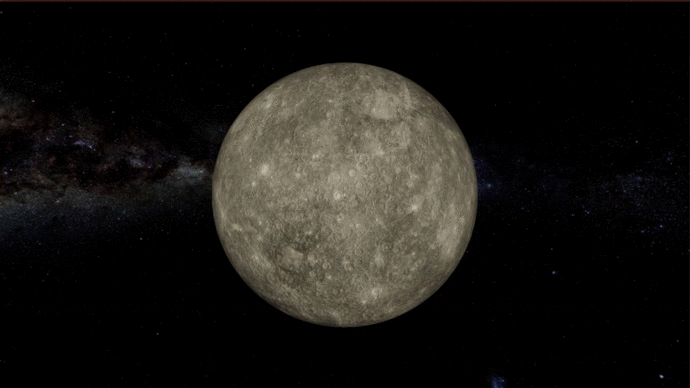

# Real-time Solar System

Real-time simulation of our Solar System in a realistic scale made in 3 weeks.

The goal was to create a real-time and realistic simulation while practicing using HDRP.

The position on the orbit was computed using Keplerian elements of each planet and the current date, following this

The positions of the 8 planets and the Moon on their orbits are accurate and update accordingly to the time of the year (estimated from the current date).  

Also the rotation of the Earth is correct and shows precisely which side faces the Sun using shaders. 

The other planets (note that the navigation between the solar system or the planets is done freely by clicking on the planets sprites or the return button) 

