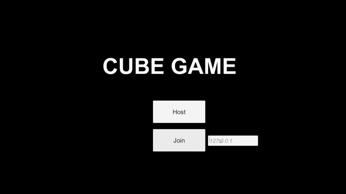
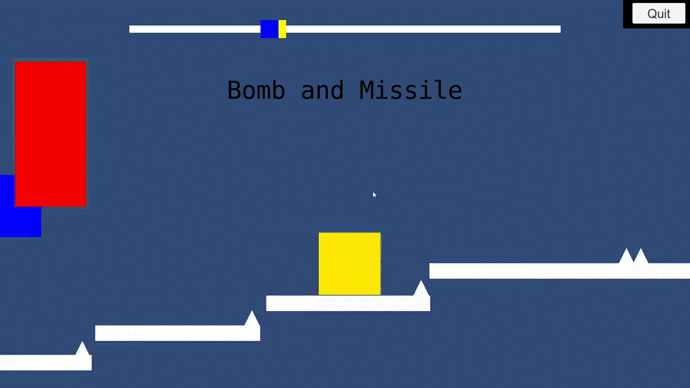
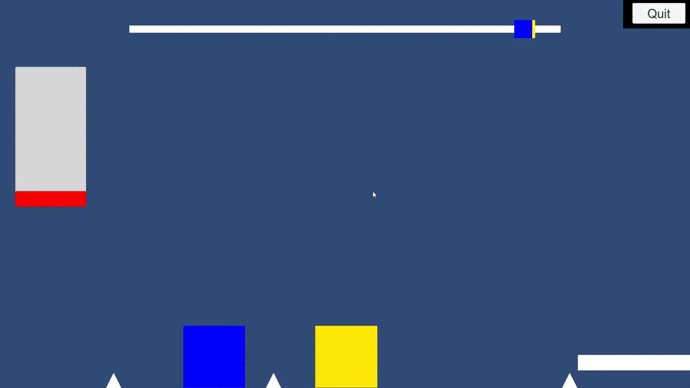

# Small Multiplayer Game

Creation of a small 2D mutlplayer game using Unity.

The goal was to create a small project to test the functionnalities of Mirror, the networking solution of Unity.
The two players who appear on the videos below are located hundreds of kilometers from each other

The players move automatically forward, and just need to jump at the right time to avoid slowing. 

There are also items used to spice things up : shoot missiles, lay or gain a huge speed boost. 

The first player that finishes the race is the winner. 

